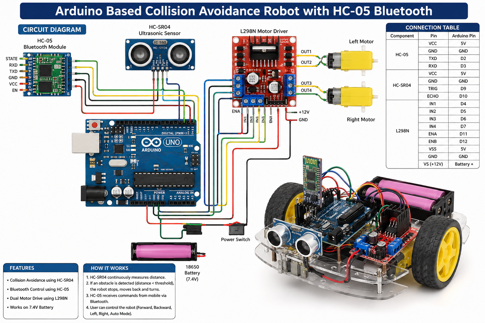
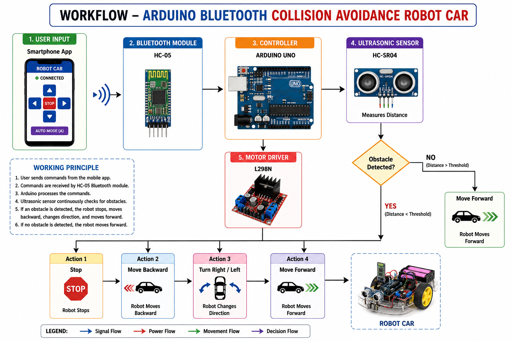
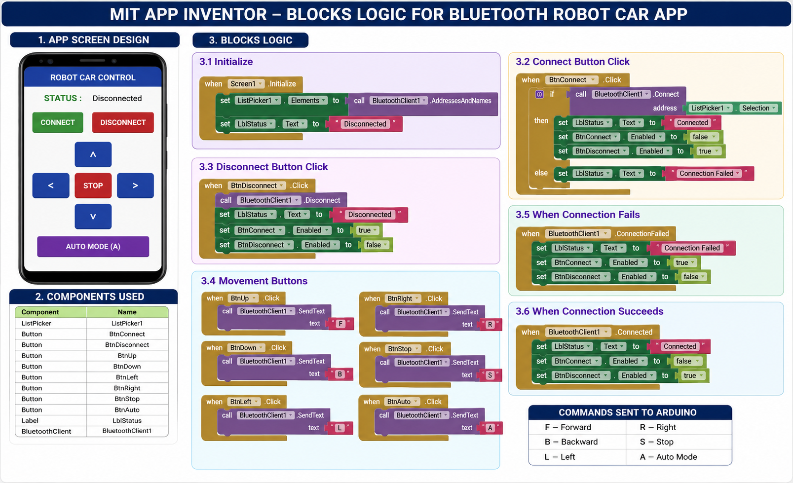

# 🤖 Arduino Bluetooth Collision Avoidance Robot Car



<h3 align="center">
🚗 Bluetooth Controlled + Obstacle Avoidance Smart Robot
</h3>

---

# 📌 Overview

This project is an intelligent Arduino-based robotic vehicle capable of:

- 📡 Bluetooth Wireless Control
- 🚧 Collision / Obstacle Avoidance
- 🤖 Autonomous Navigation
- 📲 Mobile App Control using MIT App Inventor
- ⚡ Dual Motor Driving using L298N

The robot works in two modes:

- Manual Bluetooth Mode
- Automatic Obstacle Avoidance Mode

---

# 🛠 Hardware Components

| Component                 | Quantity |
| ------------------------- | -------- |
| Arduino UNO               | 1        |
| HC-05 Bluetooth Module    | 1        |
| HC-SR04 Ultrasonic Sensor | 1        |
| L298N Motor Driver        | 1        |
| DC Motors                 | 2        |
| Robot Chassis             | 1        |
| Wheels                    | 2        |
| 18650 Battery Pack        | 1        |
| Jumper Wires              | Multiple |

---

# ⚙️ Features

✅ Bluetooth Control  
✅ Obstacle Detection  
✅ Autonomous Navigation  
✅ Real-Time Distance Measurement  
✅ Android Mobile App Control  
✅ Smart Collision Avoidance  
✅ Low Cost Robotics Solution  
✅ Beginner Friendly IoT Project

---

# 🧠 System Workflow

```text
Smartphone App
       ↓
HC-05 Bluetooth Module
       ↓
Arduino UNO Controller
       ↓
HC-SR04 Ultrasonic Sensor
       ↓
Obstacle Detection Logic
       ↓
L298N Motor Driver
       ↓
DC Motors
```

---

# 🖼 Project Images

## 📷 Robot Car


---

## 🔌 Circuit Diagram

## 

## 📱 MIT App Inventor Blocks



---

## 🔄 Project Workflow

<p align="center">
  
</p>

---

# 🔌 Pin Connections

| Module  | Pin  | Arduino |
| ------- | ---- | ------- |
| HC-05   | TX   | D2      |
| HC-05   | RX   | D3      |
| HC-SR04 | TRIG | D9      |
| HC-SR04 | ECHO | D10     |
| L298N   | IN1  | D4      |
| L298N   | IN2  | D5      |
| L298N   | IN3  | D6      |
| L298N   | IN4  | D7      |
| L298N   | ENA  | D11     |
| L298N   | ENB  | D12     |

---

# 📂 Project Structure

```text
Arduino-Bluetooth-Robot/
│
│── robot_car.ino
│
├── workflow.png
├── circuit-diagram.png
└── mit-blocks.png
│
├── MIT_App/
│   └── bluetooth_robot_app.aia
│
└── README.md
```

---

# 🚀 Arduino Firmware

## Main Features

- Bluetooth command handling
- Obstacle detection
- Autonomous movement
- Motor control
- Manual control support

---

# 📲 Bluetooth Commands

| Command | Action        |
| ------- | ------------- |
| F       | Move Forward  |
| B       | Move Backward |
| L       | Turn Left     |
| R       | Turn Right    |
| S       | Stop          |
| A       | Auto Mode     |

---

# 📡 HC-05 Configuration

| Parameter      | Value |
| -------------- | ----- |
| Bluetooth Name | HC-05 |
| Password       | 1234  |
| Baud Rate      | 9600  |

---

# 📱 MIT App Inventor App

The mobile application was developed using:

- MIT App Inventor
- Bluetooth Client Component
- Button-Based Control Logic

Features:

- Connect/Disconnect Bluetooth
- Manual Direction Control
- Auto Mode Activation

---

# 🔥 Working Principle

1. User sends commands from smartphone app.
2. HC-05 receives Bluetooth data.
3. Arduino processes commands.
4. Ultrasonic sensor continuously checks for obstacles.
5. If obstacle detected:
   - Robot stops
   - Moves backward
   - Turns direction
   - Continues forward
6. If no obstacle:
   - Robot moves normally.

---

# 🧪 Applications

- Robotics Learning
- STEM Education
- IoT Projects
- Autonomous Vehicle Research
- Embedded Systems Practice

---

# 🌟 Future Enhancements

- ESP32 Integration
- AI Navigation
- Computer Vision
- Voice Assistant Support
- IoT Cloud Monitoring
- Path Planning Algorithms

---

# 🧑‍💻 Technologies Used

- Arduino C++
- Embedded Systems
- MIT App Inventor
- Bluetooth Communication
- Robotics
- IoT

---

# 📥 Setup Instructions

## Step 1 — Upload Arduino Code

- Open Arduino IDE
- Connect Arduino UNO
- Select COM Port
- Upload firmware

---

## Step 2 — Install Mobile App

- Open MIT App Inventor App
- Pair HC-05 Bluetooth
- Connect Robot

---

## Step 3 — Start Robot

- Manual Control
- Auto Collision Avoidance

---

# 🤝 Contributing

Contributions are welcome.

1. Fork Repository
2. Create Feature Branch
3. Commit Changes
4. Push Branch
5. Open Pull Request

---

# 📜 License

This project is licensed under the MIT License.

---

# ⭐ Support

If you found this project useful:

⭐ Star the repository  
🍴 Fork the project  
📢 Share with others

---

# 👨‍💻 Author

## Shivam Singh

🚀 Embedded Systems | IoT | Robotics | AI Enthusiast

---

# 📬 Contact

- GitHub:https://github.com/ShivamMathtech/arduino-car-hc05-module

---

<h3 align="center">
🚀 Made with Arduino + Robotics + Innovation
</h3>
````
